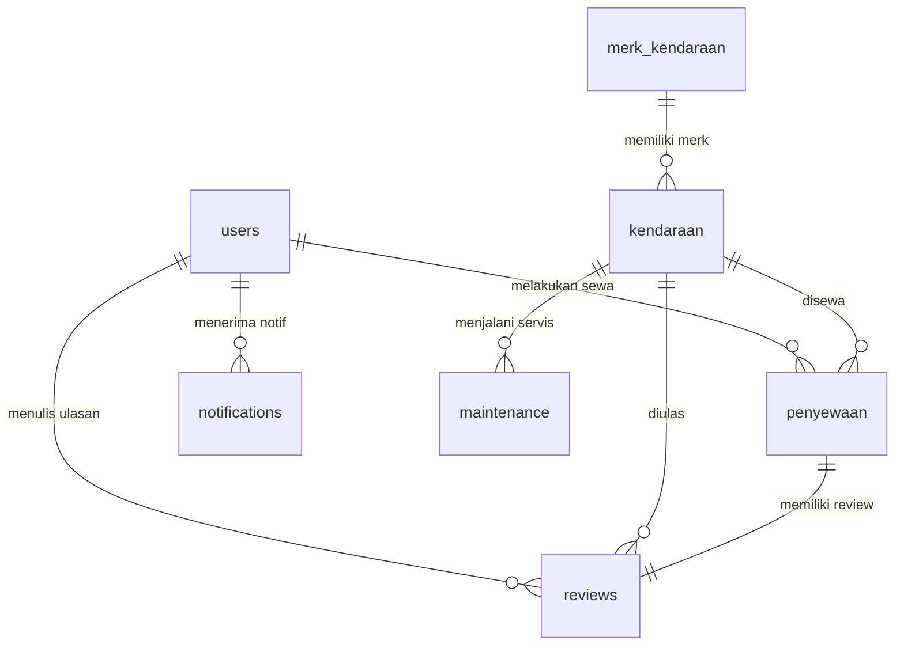

# LAPORAN PROYEK MATA KULIAH PEMROGRAMAN WEB I
## SISTEM INFORMASI PENYEWAAN KENDARAAN MEWAH & PREMIUM (FTRANS)

---

**Disusun Oleh:**
- **Nama Mahasiswa:** [Nama Anda / Kelompok]
- **Repository GitHub:** [https://github.com/ofaturu/PemrogramanWeb_1](https://github.com/ofaturu/PemrogramanWeb_1)
- **Tautan Live Produksi:** [https://ftrans.xo.je](https://ftrans.xo.je)

---

## DAFTAR ISI
1. **BAB I: PENDAHULUAN**
   - 1.1 Latar Belakang Aplikasi
   - 1.2 Tujuan dan Manfaat Sistem
2. **BAB II: TEKNOLOGI WAJIB (CORE STACK)**
   - 2.1 PHP Native versi 8.1+
   - 2.2 HTML5 (Semantik & Struktur)
   - 2.3 CSS3 (Variabel & Desain Kustom)
   - 2.4 JavaScript (PWA & Polling Asinkron)
   - 2.5 MySQL / MariaDB (Database Terelasi)
   - 2.6 MySQLi Prepared Statement (Keamanan SQLi)
   - 2.7 Git & GitHub (Version Control & Kolaborasi)
   - 2.8 Apache (Konfigurasi Web Server)
3. **BAB III: FITUR PENGEMBANGAN (NILAI TAMBAH)**
   - 3.1 Fitur 1: Lupa & Reset Kata Sandi via Email OTP
   - 3.2 Fitur 2: Verifikasi Email Pendaftaran (OTP)
   - 3.3 Fitur 3: REST API JSON Sederhana
   - 3.4 Fitur 4: QR Code & Barcode Dinamis pada PDF
   - 3.5 Fitur 5: Notifikasi Email Otomatis (SMTP PHPMailer)
   - 3.6 Fitur 6: Dark Mode Terintegrasi & Persisten
   - 3.7 Fitur 7: Ekspor Salinan Basis Data (.sql) via Aplikasi
   - 3.8 Fitur 8: Ekspor Laporan Lengkap (PDF, Excel, Word)
   - 3.9 Fitur 9: Grafik Interaktif (Chart.js) Responsif Tema
   - 3.10 Fitur 10: VPS / Hosting Deployment & SSL
4. **BAB IV: ANALISIS SKEMA BASIS DATA (DATABASE SCHEMA)**
   - 4.1 Tabel-Tabel Sistem & Relasinya
5. **BAB V: KESIMPULAN & PENUTUP**

---

## BAB I: PENDAHULUAN

### 1.1 Latar Belakang Aplikasi
Perkembangan teknologi informasi menuntut industri transportasi dan jasa, seperti rental mobil mewah, untuk mendigitalisasi proses bisnis mereka. **FTrans** hadir sebagai solusi sistem informasi penyewaan kendaraan mewah dan premium berbasis web. Aplikasi ini menjembatani kebutuhan penyewa yang menginginkan pelayanan VIP secara cepat, transparan, dan aman, serta membantu pengelola (administrator) dalam mendata armada, menyetujui transaksi pembayaran, mengontrol perawatan kendaraan, dan melihat analitik keuangan secara real-time.

### 1.2 Tujuan dan Manfaat Sistem
- **Bagi Penyewa**: Mempermudah pencarian kendaraan mewah yang tersedia, melakukan booking secara instan, melakukan pembayaran digital via Xendit VA/E-Wallet, menerima invoice resmi berbentuk PDF secara otomatis di email, serta menulis ulasan penilaian armada.
- **Bagi Administrator**: Menyediakan dashboard manajemen armada (CRUD), sistem verifikasi bukti bayar manual maupun otomatis (Xendit Webhook), pencatatan perawatan (*maintenance*) berkala, pengiriman notifikasi instan, serta ekspor laporan operasional ke berbagai format dokumen (PDF, Excel, Word).

---

## BAB II: TEKNOLOGI WAJIB (CORE STACK)

Pada bagian ini dijelaskan penerapan 9 kriteria teknologi wajib yang diimplementasikan di dalam kode aplikasi FTrans:

### 2.1 PHP Native versi 8.1+
Sistem dibangun murni menggunakan **PHP Native** tanpa menggunakan framework pihak ketiga (seperti Laravel atau CodeIgniter) guna memenuhi kriteria dasar mata kuliah. Aplikasi ini memanfaatkan fitur-fitur PHP modern (v8.1+), seperti *null coalescing operator* (`??`), fungsi hashing kata sandi modern (`password_hash`), penanganan *session* aman, serta integrasi Composer autoload.

**Contoh Kode (Membaca Variabel Lingkungan & Session di [config.php](file:///c:/xampp/htdocs/PemrogramanWeb_1/ftrans/config.php)):**
```php
if (session_status() === PHP_SESSION_NONE) {
    session_start();
}
// PHP 8+ Null Coalescing Operator & environment fallback
$databaseHost     = getenv('DB_HOST') ?: ($_ENV['DB_HOST'] ?? 'sql211.infinityfree.com');
$databaseName     = getenv('DB_NAME') ?: ($_ENV['DB_NAME'] ?? 'if0_42443860_ftrans');
```

### 2.2 HTML5 (Semantik & Struktur)
Setiap halaman mengimplementasikan standar **HTML5** dengan struktur elemen semantik seperti `<nav>`, `<aside>`, `<header>`, `<main>`, `<section>`, dan `<footer>` guna mempermudah pembacaan layout (aksesibilitas) dan performa SEO.

**Contoh Kode (Elemen HTML5 di [index.php](file:///c:/xampp/htdocs/PemrogramanWeb_1/ftrans/index.php)):**
```html
<!DOCTYPE html>
<html lang="id">
<head>
    <meta charset="utf-8">
    <meta name="viewport" content="width=device-width, initial-scale=1.0, shrink-to-fit=no">
    <title>FTrans — Sewa Mobil Mewah & Premium Terbaik</title>
</head>
<body>
    <nav class="navbar navbar-expand-lg navbar-luxury fixed-top py-3">...</nav>
    <section class="hero-section" id="hero">...</section>
    <main>...</main>
</body>
</html>
```

### 2.3 CSS3 (Variabel & Desain Kustom)
Styling aplikasi didukung oleh Bootstrap 5 / CoreUI v5 yang dicustom menggunakan **CSS3** murni di dalam [css/landing.css](file:///c:/xampp/htdocs/PemrogramanWeb_1/ftrans/css/landing.css) dan [css/style.css](file:///c:/xampp/htdocs/PemrogramanWeb_1/ftrans/css/style.css). Fitur CSS3 yang digunakan meliputi:
- CSS Variables (`:root`) untuk pengelolaan palet warna terang/gelap.
- Backdrop-filter untuk efek kaca transparan (*glassmorphism*).
- Media Queries untuk layout responsif di ponsel cerdas.

**Contoh Kode (CSS3 Custom Properties di [css/landing.css](file:///c:/xampp/htdocs/PemrogramanWeb_1/ftrans/css/landing.css)):**
```css
:root, [data-coreui-theme="light"] {
    --bg-primary: #f3f4f7;
    --bg-secondary: #ffffff;
    --text-main: #0f172a;
    --accent-gold: #5856d6;
    --card-shadow: 0 10px 30px -10px rgba(0, 0, 0, 0.05);
}
.navbar-luxury {
    background: rgba(var(--bg-rgb), 0.75);
    backdrop-filter: blur(15px);
    -webkit-backdrop-filter: blur(15px);
    border-bottom: 1px solid var(--border-color);
}
```

### 2.4 JavaScript (PWA & Polling Asinkron)
JavaScript digunakan untuk meningkatkan kenyamanan interaksi pengguna. Kode JavaScript diaplikasikan pada:
- **PWA Service Worker** di [sw.js](file:///c:/xampp/htdocs/PemrogramanWeb_1/ftrans/sw.js) untuk proses caching offline.
- **Real-Time Polling** status pembayaran virtual account dengan Fetch API secara asinkron tanpa reload halaman di [bayar.php](file:///c:/xampp/htdocs/PemrogramanWeb_1/ftrans/bayar.php).

**Contoh Kode (Fetch API & Interval Polling di [bayar.php](file:///c:/xampp/htdocs/PemrogramanWeb_1/ftrans/bayar.php)):**
```javascript
const checkInterval = setInterval(async () => {
    try {
        const response = await fetch(`check_status.php?id=${idSewa}`);
        const data = await response.json();
        if (data.is_verified) {
            clearInterval(checkInterval);
            showVerificationSuccessPopup(); // Tampilkan popup modal sukses bayar
        }
    } catch (error) {
        console.error("Gagal melakukan polling status pembayaran:", error);
    }
}, 5000); // Polling setiap 5 detik
```

### 2.5 MySQL / MariaDB (Database Terelasi)
Semua data disimpan di dalam RDBMS **MySQL/MariaDB**. Basis data dirancang dengan normalisasi yang baik, terdiri dari 8 tabel utama yang saling berelasi menggunakan kunci asing (*foreign key*) untuk menjamin konsistensi data referensial (misalnya menghapus transaksi sewa akan menghapus review terkait jika diatur Cascade). Skema sql dapat dilihat pada file [ftrans.sql](file:///c:/xampp/htdocs/PemrogramanWeb_1/ftrans/ftrans.sql).

### 2.6 MySQLi Prepared Statement (Keamanan SQLi)
Untuk mencegah celah keamanan kritis **SQL Injection (SQLi)**, seluruh kueri database yang memproses inputan dari pengguna luar (form login, filter cari, registrasi, input ulasan) wajib diimplementasikan menggunakan **Prepared Statement** dari modul **MySQLi Extension**.

**Contoh Kode (Prepared Statement di [check_status.php](file:///c:/xampp/htdocs/PemrogramanWeb_1/ftrans/check_status.php)):**
```php
// Prepared Statement yang aman dari SQL Injection
$stmt = mysqli_prepare($mysqli, "SELECT status, id_user FROM penyewaan WHERE id_sewa = ?");
mysqli_stmt_bind_param($stmt, 'i', $id_sewa);
mysqli_stmt_execute($stmt);
$res = mysqli_stmt_get_result($stmt);
$rental = mysqli_fetch_assoc($res);
mysqli_stmt_close($stmt);
```

### 2.7 Git & GitHub (Version Control & Kolaborasi)
Proyek ini menggunakan **Git** sebagai pengendali versi lokal untuk merekam setiap riwayat perubahan file. Repositori di-push ke platform **GitHub** di `https://github.com/ofaturu/PemrogramanWeb_1` untuk kolaborasi dan penyimpanan cadangan repositori secara publik/private. Hal ini dibuktikan dengan file konfigurasi `.git` yang aktif di root folder.

### 2.8 Apache (Konfigurasi Web Server)
Aplikasi dideploy pada web server **Apache**. Selama proses pengembangan, aplikasi berjalan di atas Apache lokal bawaan XAMPP. Pada lingkungan produksi, konfigurasi Apache disesuaikan di server hosting InfinityFree untuk menangani routing PHP, SSL HTTPS, dan proteksi file konfigurasi melalui skema file `.htaccess` (jika ada).

---

## BAB III: FITUR PENGEMBANGAN (NILAI TAMBAH)

Aplikasi FTrans mengintegrasikan **10 fitur pengembangan nilai tambah** untuk memaksimalkan fungsionalitas dan interaktivitas:

### 3.1 Fitur 1: Lupa & Reset Kata Sandi via Email OTP
Pengguna yang lupa kata sandi dapat memasukkan email mereka di [forgot_password.php](file:///c:/xampp/htdocs/PemrogramanWeb_1/ftrans/forgot_password.php). Sistem akan mencocokkan email di tabel `users`, men-generate kode OTP 6-digit acak, dan menyimpannya di kolom `otp_code` beserta batas kedaluwarsa 15 menit (`otp_expiry`). Kode tersebut dikirimkan ke email user. Pada [reset_password.php](file:///c:/xampp/htdocs/PemrogramanWeb_1/ftrans/reset_password.php), pengguna memasukkan OTP tersebut bersama password barunya yang akan di-hash ulang menggunakan `password_hash`.

**Alur Kode Pengiriman OTP Reset ([forgot_password.php](file:///c:/xampp/htdocs/PemrogramanWeb_1/ftrans/forgot_password.php)):**
```php
$otp = strval(rand(100000, 999999));
$otp_expiry = date('Y-m-d H:i:s', strtotime('+15 minutes'));

$update = mysqli_prepare($mysqli, "UPDATE users SET otp_code = ?, otp_expiry = ? WHERE email = ?");
mysqli_stmt_bind_param($update, 'sss', $otp, $otp_expiry, $email);
if (mysqli_stmt_execute($update)) {
    send_reset_otp_email($email, $user['nama'], $otp); // Dikirim via SMTP
    header('Location: reset_password.php?email=' . urlencode($email) . '&msg=sent');
}
```

### 3.2 Fitur 2: Verifikasi Email Pendaftaran (OTP)
Saat pengguna baru melakukan pendaftaran akun di [register.php](file:///c:/xampp/htdocs/PemrogramanWeb_1/ftrans/register.php), status akun mereka diatur menjadi belum terverifikasi (`is_verified = 0`). Sistem secara otomatis mengirimkan kode verifikasi OTP 6 digit ke email pendaftar. Pengguna harus diarahkan ke [verify.php](file:///c:/xampp/htdocs/PemrogramanWeb_1/ftrans/verify.php) untuk memverifikasi akun mereka sebelum dapat melakukan pemesanan sewa kendaraan. Setelah verifikasi sukses, sistem menyediakan tautan cepat integrasi ke WhatsApp Admin untuk pemberitahuan kesiapan bertransaksi.

**Kutipan Kode Verifikasi OTP ([verify.php](file:///c:/xampp/htdocs/PemrogramanWeb_1/ftrans/verify.php)):**
```php
$stmt = mysqli_prepare($mysqli, "SELECT otp_code, otp_expiry FROM users WHERE email = ?");
// ... setelah dicocokkan dan OTP valid:
$update = mysqli_prepare($mysqli, "UPDATE users SET is_verified = 1, otp_code = NULL, otp_expiry = NULL WHERE email = ?");
mysqli_stmt_bind_param($update, 's', $email);
mysqli_stmt_execute($update);
```

### 3.3 Fitur 3: REST API JSON Sederhana
FTrans mengimplementasikan API internal sederhana yang mengembalikan respon dalam format JSON (`Content-Type: application/json`).
- [check_status.php](file:///c:/xampp/htdocs/PemrogramanWeb_1/ftrans/check_status.php): API publik terproteksi untuk memeriksa status pembayaran berdasarkan `id_sewa`.
- [get_notifications.php](file:///c:/xampp/htdocs/PemrogramanWeb_1/ftrans/get_notifications.php): API untuk membaca list notifikasi belum terbaca secara dinamis dan melakukan update "mark as read" asinkron melalui request HTTP POST.

**Contoh Respon JSON API ([check_status.php](file:///c:/xampp/htdocs/PemrogramanWeb_1/ftrans/check_status.php)):**
```php
header('Content-Type: application/json; charset=utf-8');
// ... logika data fetching ...
echo json_encode([
    'id_sewa'     => $id_sewa,
    'status'      => $status,
    'is_verified' => $is_verified
]);
exit;
```

### 3.4 Fitur 4: QR Code & Barcode Dinamis pada PDF
Ketika mengekspor struk pembayaran atau kuitansi sewa ke file PDF, sistem mencetak **QR Code** dan **Barcode** secara otomatis:
- **QR Code**: Menampung URL verifikasi langsung (diarahkan ke `bayar.php?id={id_sewa}`). Menggunakan API dari `api.qrserver.com`. Petugas rental cukup melakukan scan pada kertas PDF untuk memverifikasi kecocokan status transaksi di database.
- **Barcode**: Bertipe Code128 yang merepresentasikan kode faktur transaksi (misal `INV-00045`). Menggunakan API render `bwipjs-api.metafloor.com`.

**Kutipan Kode QR & Barcode ([export.php](file:///c:/xampp/htdocs/PemrogramanWeb_1/ftrans/export.php)):**
```php
$inv_code_str = 'INV-' . str_pad($detail_data['id_sewa'], 5, '0', STR_PAD_LEFT);
$qr_code_src = "https://api.qrserver.com/v1/create-qr-code/?size=150x150&data=" . urlencode($receipt_url);
$barcode_src = "https://bwipjs-api.metafloor.com/bwipjs?bcid=code128&text=" . urlencode($inv_code_str) . "&scale=2&rotate=N&includetext";

// Di dalam template HTML PDF:
$html .= '';
$html .= '';
```

### 3.5 Fitur 5: Notifikasi Email Otomatis (SMTP PHPMailer)
Aplikasi mengirim email notifikasi resmi secara langsung menggunakan pustaka **PHPMailer** yang terhubung ke server SMTP (seperti Gmail SMTP dengan enkripsi SSL pada port 465). Protokol ini diatur di [send_invoice.php](file:///c:/xampp/htdocs/PemrogramanWeb_1/ftrans/send_invoice.php). Email otomatis dikirim ketika:
1. Pengguna mendaftar akun baru (mengirim kode OTP verifikasi).
2. Pengguna meminta reset password (mengirim kode OTP reset).
3. Pengguna melakukan booking sewa baru (mengirim PDF Invoice tagihan terlampir).
4. Pembayaran sukses terverifikasi (mengirim PDF Kuitansi lunas terlampir).

**Konfigurasi PHPMailer SMTP ([send_invoice.php](file:///c:/xampp/htdocs/PemrogramanWeb_1/ftrans/send_invoice.php)):**
```php
$mail = new PHPMailer(true);
$mail->isSMTP();
$mail->Host       = $_ENV['SMTP_HOST'] ?? 'smtp.gmail.com';
$mail->SMTPAuth   = true;
$mail->Username   = $_ENV['SMTP_USER'] ?? '';
$mail->Password   = $_ENV['SMTP_PASS'] ?? '';
$mail->Port       = intval($_ENV['SMTP_PORT'] ?? 465);
$mail->SMTPSecure = 'ssl';
// Lampirkan PDF buatan mPDF secara instan dari memori
$mail->addStringAttachment($pdf_content, 'Invoice_FTrans_' . $id_sewa . '.pdf');
```

### 3.6 Fitur 6: Dark Mode Terintegrasi & Persisten
Sistem mendukung perpindahan tema gelap (*Dark Mode*), terang (*Light Mode*), atau otomatis mengikuti setelan sistem operasi (*Auto*). Tema diterapkan melalui penambahan atribut `data-coreui-theme` pada tag `<html>` dokumen. Javascript [js/color-modes.js](file:///c:/xampp/htdocs/PemrogramanWeb_1/ftrans/js/color-modes.js) bertugas menjaga pilihan pengguna tetap aktif meskipun halaman dimuat ulang menggunakan penyimpanan lokal browser (`localStorage`).

**Logika Persistensi localStorage ([js/color-modes.js](file:///c:/xampp/htdocs/PemrogramanWeb_1/ftrans/js/color-modes.js)):**
```javascript
const THEME = 'coreui-free-bootstrap-admin-template-theme';
const getStoredTheme = () => localStorage.getItem(THEME);
const setStoredTheme = theme => localStorage.setItem(THEME, theme);
// Saat tombol tema diklik:
toggle.addEventListener('click', () => {
    const theme = toggle.getAttribute('data-coreui-theme-value');
    setStoredTheme(theme);
    setTheme(theme);
});
```

### 3.7 Fitur 7: Ekspor Salinan Basis Data (.sql) via Aplikasi
Untuk mempermudah pemeliharaan sistem oleh admin tanpa harus membuka phpMyAdmin, disediakan halaman [backup.php](file:///c:/xampp/htdocs/PemrogramanWeb_1/ftrans/backup.php). Fitur ini mengekstrak daftar semua tabel, struktur skema pembuatan tabel (`SHOW CREATE TABLE`), dan seluruh baris data di database secara dinamis menggunakan sintaks PHP Native. Output skrip langsung diunduh dalam bentuk file sql terkompresi.

**Logika Export Database SQL ([backup.php](file:///c:/xampp/htdocs/PemrogramanWeb_1/ftrans/backup.php)):**
```php
$tables = [];
$result = mysqli_query($mysqli, "SHOW TABLES");
while ($row = mysqli_fetch_row($result)) { $tables[] = $row[0]; }

foreach ($tables as $table) {
    $res_struct = mysqli_query($mysqli, "SHOW CREATE TABLE `$table`");
    $row_struct = mysqli_fetch_row($res_struct);
    $sql .= "DROP TABLE IF EXISTS `$table`;\n" . $row_struct[1] . ";\n\n";
    // ... lalu kueri seluruh data tabel dan append format INSERT INTO ...
}
header('Content-Type: application/octet-stream');
header('Content-Disposition: attachment; filename="backup_ftrans_' . date('Y-m-d') . '.sql"');
echo $sql;
```

### 3.8 Fitur 8: Ekspor Laporan Lengkap (PDF, Excel, Word)
Sistem administrasi FTrans menyediakan kapabilitas ekspor data laporan operasional yang dinamis ke dalam tiga format profesional yang dikelola di dalam [export.php](file:///c:/xampp/htdocs/PemrogramanWeb_1/ftrans/export.php):
- **PDF**: Didukung oleh pustaka `mpdf/mpdf` untuk mencetak cetakan layout kuitansi dengan CSS kustom.
- **Excel**: Didukung oleh pustaka `phpoffice/phpspreadsheet` untuk rekapitulasi data tabel (laporan transaksi penjualan bulanan) lengkap dengan pemformatan kolom.
- **Word**: Didukung oleh pustaka `phpoffice/phpword` untuk membuat surat pengantar laporan dalam format dokumen teks `.docx`.

### 3.9 Fitur 9: Grafik Interaktif (Chart.js) Responsif Tema
Di dalam halaman analisis keuangan admin [analytics.php](file:///c:/xampp/htdocs/PemrogramanWeb_1/ftrans/analytics.php), diterapkan visualisasi analitik berupa:
1. Grafik garis pendapatan vs pengeluaran biaya servis kendaraan per bulan.
2. Grafik donat (doughnut) porsi popularitas merk kendaraan yang paling sering disewa.
Fitur ini diimplementasikan menggunakan pustaka **Chart.js**. Terdapat pendeteksi perubahan tema (`MutationObserver`) sehingga warna font label dan garis grid pada grafik akan menyesuaikan secara real-time saat pengguna menukar tema gelap atau terang tanpa merusak instance canvas.

**Kutipan Sinkronisasi Grafik dengan Tema ([analytics.php](file:///c:/xampp/htdocs/PemrogramanWeb_1/ftrans/analytics.php)):**
```javascript
const observer = new MutationObserver((mutations) => {
  mutations.forEach((mutation) => {
    if (mutation.attributeName === 'data-coreui-theme') {
      const newIsDark = document.documentElement.getAttribute('data-coreui-theme') === 'dark';
      // Perbarui konfigurasi warna Chart.js secara dinamis
      incomeChartInstance.options.scales.x.grid.color = newIsDark ? 'rgba(255, 255, 255, 0.08)' : 'rgba(0, 0, 0, 0.05)';
      incomeChartInstance.update();
    }
  });
});
observer.observe(document.documentElement, { attributes: true });
```

### 3.10 Fitur 10: VPS / Hosting Deployment & SSL
Aplikasi FTrans telah dideploy secara online dan dapat diakses publik pada domain **https://ftrans.xo.je**. Server di-host pada InfinityFree yang menggunakan kombinasi web server Apache/LiteSpeed dengan alokasi database MySQL aktif. Koneksi HTTPS diamankan menggunakan sertifikat SSL Cloudflare guna menjamin keamanan transfer data kredensial login dan transaksi dari penyadap luar.

---

## BAB IV: ANALISIS SKEMA BASIS DATA (DATABASE SCHEMA)

Berikut adalah ringkasan skema database `ftrans` yang terdiri atas 8 tabel penting:



### 4.1 Tabel-Tabel Sistem & Relasinya
1. **`users`**: Menyimpan kredensial pengguna, mencakup nama, email terenkripsi, hash password, nomor HP, role akses (admin/user), tier keanggotaan, status verifikasi email, serta token OTP beserta tanggal kedaluwarsanya.
2. **`kendaraan`**: Menyimpan katalog kendaraan (mobil dan motor), harga sewa per hari, spesifikasi teknis (transmisi, tipe bahan bakar, tempat duduk, warna), stok, status ketersediaan, dan data gambar. Berelasi dengan `id_merk`.
3. **`merk_kendaraan`**: Berisi nama merk kendaraan seperti Toyota, Honda, BMW, Audi, Ducati, dll.
4. **`penyewaan`**: Tabel transaksi utama yang menyimpan foreign key `id_user` dan `kode_unik_kendaraan`, tanggal sewa-kembali, total biaya, status pemesanan, bukti upload transfer, serta ID pembayaran virtual account Xendit.
5. **`maintenance`**: Mencatat riwayat pemeliharaan berkala kendaraan (deskripsi servis, tanggal perbaikan, estimasi biaya). Berelasi ke `kode_unik_kendaraan`.
6. **`reviews`**: Menyimpan penilaian kepuasan pelanggan berupa rating bintang (1-5) dan komentar ulasan tertulis.
7. **`notifications`**: Menyimpan log pesan notifikasi untuk user (misal status pembayaran sukses) dan admin (notif pesanan baru masuk).
8. **`landing_settings`**: Menyimpan konfigurasi CMS dinamis untuk halaman depan landing page (judul hero, sub-judul, dan banner gambar).

---

## BAB V: KESIMPULAN & PENUTUP

Sistem Informasi Penyewaan Kendaraan **FTrans** telah berhasil dibangun dengan memanfaatkan teknologi web native inti (PHP 8.1+, HTML5, CSS3, JS, MySQL) dengan memperhatikan kaidah keamanan database (Prepared Statements). Penambahan 10 fitur kembangan seperti verifikasi OTP email, integrasi REST API, grafik interaktif, PWA, ekspor laporan multiformat, enkripsi password, dan deployment online terenkripsi SSL membuktikan bahwa sistem ini layak dan siap digunakan untuk menangani proses operasional bisnis secara modern, aman, dan efisien. Laporan ini diajukan untuk memenuhi penilaian mata kuliah Pemrograman Web dengan kriteria lengkap dan terdokumentasi dengan baik.
